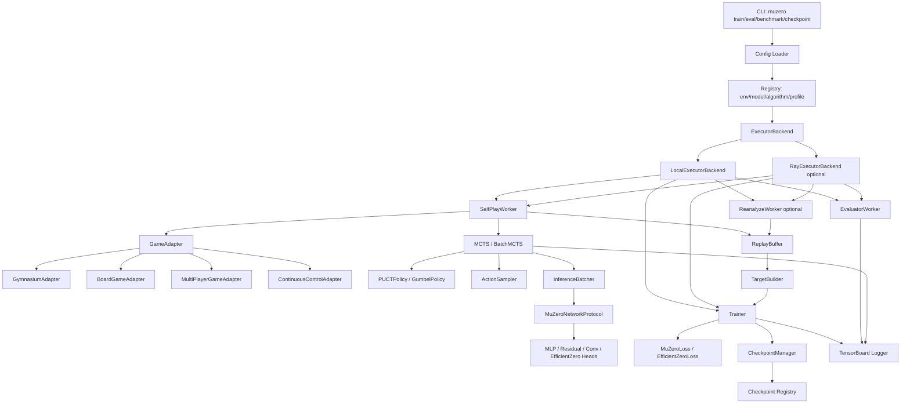
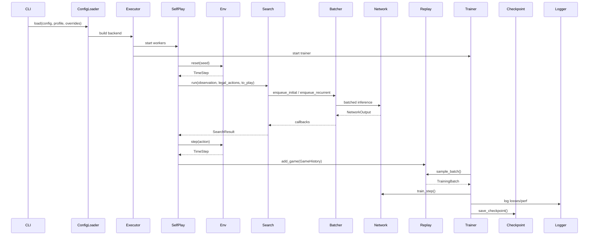

# 系统架构设计

## 0. 元信息

| 项 | 内容 |
|---|---|
| 项目名称 | MuZero Rebuilt |
| 项目方式 | 从零重构 |
| 目标硬件 | RTX 4060 Laptop，默认按单 GPU、8GB 显存级别约束设计 |
| 主技术栈 | Python 3.11、PyTorch 2.x、Gymnasium、TensorBoard、pytest、ruff、pyright |
| 分布式策略 | 默认 Local Executor；Ray 作为可选后端 |
| 算法路线 | Standard MuZero baseline → Batch MCTS → EfficientZero 扩展 → Sampled/Gumbel 扩展 → 多人游戏/权重注册/性能剖析 |
| 当前阶段 | 阶段 2：架构设计 |
| 后续阶段 | 阶段 3：生成 `plan.md`，细化到 Codex 可直接执行的步骤 |

---

## 1. 架构总览

### 1.1 核心设计原则

1. **MuZero Core 先稳定，再叠加扩展**
   - 第一层实现标准 MuZero：representation、dynamics、prediction、MCTS、replay、trainer。
   - 第二层接入 Batch MCTS：CPU tree + GPU batched inference queue。
   - 第三层接入 EfficientZero：value prefix、consistency loss、reanalyze 预留。
   - 第四层接入 Sampled/Gumbel：连续动作采样、低仿真预算搜索。
   - 第五层接入多人游戏、checkpoint registry、Ray optional backend、benchmark/profiling。

2. **算法模块不得直接依赖执行后端**
   - `muzero.search`、`muzero.training`、`muzero.replay` 不允许直接 import `ray`。
   - Ray 只能出现在 `muzero.execution.ray_backend`。
   - 调用方依赖 `ExecutorBackend` 协议，默认实现为 `LocalExecutorBackend`。

3. **环境层统一 GameAdapter**
   - Gymnasium、棋类、多人博弈、连续控制都转换为统一 `GameAdapter`。
   - 不允许把连续动作离散化硬编码在环境文件中。
   - `terminated` 与 `truncated` 必须在 `TimeStep` 中保留。

4. **搜索层从第一版支持 batch inference**
   - MCTS selection/backup 在 CPU。
   - network inference 统一进入 `InferenceBatcher`。
   - `InferenceBatcher.flush()` 聚合请求后一次调用 `network.initial_inference()` 或 `network.recurrent_inference()`。

5. **多人 value vector 从底层数据结构开始支持**
   - `value` 统一允许标量 `[B]` 或向量 `[B, num_players]`。
   - replay、target、backup、evaluator 均保留 `num_players` 与 `to_play` 信息。
   - 二人零和只是特殊投影，不作为底层唯一表示。

6. **RTX 4060 Laptop 默认 profile**
   - 默认启用 CUDA + AMP。
   - 默认小 batch、小网络、有限 MCTS simulations。
   - `torch.compile` 作为 opt-in，不默认强制启用。
   - Atari/视觉任务作为可选 profile，不作为初始 smoke test。

---

### 1.2 架构图



---

## 2. 模块划分

## 模块 A：`muzero.config`

### 职责
加载、校验、合并 YAML 配置，生成强类型配置对象，并提供硬件 profile。

### 输入
- `configs/base.yaml`
- `configs/profiles/laptop_rtx4060_8gb.yaml`
- CLI override：`--set training.batch_size=64`

### 输出
- `MuZeroConfig`
- `ResolvedRuntimeConfig`

### 依赖
- Python 标准库
- `pydantic` 或 `dataclasses`
- `yaml`

### 核心类/接口

#### `class MuZeroConfig`
字段：
- `project: ProjectConfig`
- `algorithm: AlgorithmConfig`
- `environment: EnvironmentConfig`
- `network: NetworkConfig`
- `search: SearchConfig`
- `training: TrainingConfig`
- `replay: ReplayConfig`
- `execution: ExecutionConfig`
- `checkpoint: CheckpointConfig`
- `logging: LoggingConfig`

#### `class AlgorithmConfig`
字段：
- `name: Literal["muzero", "efficientzero", "sampled_muzero", "gumbel_muzero"]`
- `use_value_prefix: bool`
- `use_consistency_loss: bool`
- `use_reanalyze: bool`
- `num_players: int`

#### `class RuntimeProfile`
字段：
- `name: str`
- `device: Literal["cpu", "cuda"]`
- `precision: Literal["fp32", "amp_fp16", "amp_bf16"]`
- `compile_model: bool`
- `inference_batch_size: int`
- `training_batch_size: int`
- `num_self_play_workers: int`
- `num_simulations: int`

#### `class ConfigLoader`
方法：
- `load(path: Path, overrides: dict[str, Any] | None = None) -> MuZeroConfig`
- `load_profile(name: str) -> RuntimeProfile`
- `merge(base: dict[str, Any], override: dict[str, Any]) -> dict[str, Any]`
- `validate(config: dict[str, Any]) -> MuZeroConfig`
- `dump_resolved(config: MuZeroConfig, out_path: Path) -> None`

### 关键约束
- 所有魔法数字必须进入配置。
- 训练入口不得直接硬编码 batch size、learning rate、num simulations。
- `laptop_rtx4060_8gb` profile 必须存在。

---

## 模块 B：`muzero.core`

### 职责
定义跨模块共享类型、游戏历史、action/reward/value 表示、support transform、player perspective。

### 输入
- observation/action/reward/value 原始数据
- 环境 metadata
- MCTS 结果

### 输出
- `TimeStep`
- `GameHistory`
- `NetworkOutput`
- `TrainingBatch`
- `SearchResult`

### 依赖
- `numpy`
- `torch`
- `typing`

### 核心类/接口

#### `class TimeStep`
字段：
- `observation: Observation`
- `reward: Reward`
- `terminated: bool`
- `truncated: bool`
- `to_play: int`
- `legal_actions: LegalActions | None`
- `info: dict[str, Any]`

属性：
- `done: bool`，返回 `terminated or truncated`

#### `class ActionSpaceSpec`
字段：
- `type: Literal["discrete", "continuous", "sampled"]`
- `n: int | None`
- `shape: tuple[int, ...] | None`
- `low: np.ndarray | None`
- `high: np.ndarray | None`

#### `class NetworkOutput`
字段：
- `value: torch.Tensor`
- `reward: torch.Tensor`
- `policy_logits: torch.Tensor`
- `hidden_state: torch.Tensor`
- `value_prefix: torch.Tensor | None`
- `projection: torch.Tensor | None`

#### `class GameHistory`
字段：
- `observations: list[Observation]`
- `actions: list[Action]`
- `rewards: list[Reward]`
- `players: list[int]`
- `root_values: list[Value]`
- `child_visit_distributions: list[PolicyTarget]`
- `legal_action_masks: list[Mask | None]`
- `search_metadata: list[SearchMetadata]`

方法：
- `append_initial(timestep: TimeStep) -> None`
- `append(action: Action, timestep: TimeStep, search_result: SearchResult) -> None`
- `make_target(start_index: int, num_unroll_steps: int, td_steps: int, discount: float) -> TargetSequence`
- `__len__() -> int`

#### `class SupportTransform`
方法：
- `scalar_to_support(x: torch.Tensor) -> torch.Tensor`
- `support_to_scalar(logits: torch.Tensor) -> torch.Tensor`

#### `class PlayerPerspective`
方法：
- `project_value(value: torch.Tensor, to_play: int, num_players: int) -> torch.Tensor`
- `invert_reward(reward: torch.Tensor, to_play: int, num_players: int) -> torch.Tensor`

### 关键约束
- `GameHistory` 不做环境逻辑，只记录轨迹和搜索结果。
- `SupportTransform` 必须有独立单元测试。
- `PlayerPerspective` 必须覆盖单人、二人零和、多人 general-sum 三类测试。

---

## 模块 C：`muzero.envs`

### 职责
将 Gymnasium、棋类、多玩家环境、连续控制环境统一适配为 `GameAdapter`。

### 输入
- Gymnasium env id，如 `CartPole-v1`
- 内置 board game config，如 TicTacToe、Connect4
- custom env factory

### 输出
- `TimeStep`
- `ActionSpaceSpec`
- legal action mask
- current player id

### 依赖
- `gymnasium`
- `numpy`

### 核心类/接口

#### `class GameAdapter(Protocol)`
方法：
- `reset(seed: int | None = None) -> TimeStep`
- `step(action: Action) -> TimeStep`
- `legal_actions() -> LegalActions | None`
- `current_player() -> int`
- `num_players() -> int`
- `action_space_spec() -> ActionSpaceSpec`
- `observation_space_spec() -> ObservationSpaceSpec`
- `render(mode: str = "human") -> Any`
- `close() -> None`

#### `class GymnasiumAdapter(GameAdapter)`
字段：
- `env_id: str`
- `env: gymnasium.Env`

方法：
- `reset(seed: int | None = None) -> TimeStep`
- `step(action: Action) -> TimeStep`
- `legal_actions() -> None`
- `current_player() -> int`，单智能体固定返回 `0`
- `num_players() -> int`，固定返回 `1`

关键实现：
- `env.step(action)` 返回值必须解析为：
  - `observation`
  - `reward`
  - `terminated`
  - `truncated`
  - `info`
- 不允许重新压成旧 Gym 的 `done` 后丢弃 `terminated/truncated`。

#### `class BoardGameAdapter(GameAdapter)`
适配：
- TicTacToe
- Connect4
- Gomoku

方法：
- `legal_actions() -> np.ndarray`
- `current_player() -> int`
- `num_players() -> int`

#### `class ContinuousControlAdapter(GameAdapter)`
适配：
- Pendulum
- MountainCarContinuous
- MuJoCo optional

方法：
- `action_space_spec() -> ActionSpaceSpec(type="continuous")`

#### `class EnvFactory`
方法：
- `make(config: EnvironmentConfig) -> GameAdapter`
- `register(name: str, factory: Callable[..., GameAdapter]) -> None`

### 关键约束
- 不直接依赖旧 `gym`。
- 不在 env adapter 中实现 MCTS 或策略逻辑。
- 连续动作采样由 `muzero.search.ActionSampler` 负责。

---

## 模块 D：`muzero.models`

### 职责
实现 MuZero 网络协议和不同网络架构：MLP、Residual、Conv、EfficientZero 扩展 heads。

### 输入
- observation batch
- hidden state batch
- action batch

### 输出
- `NetworkOutput`

### 依赖
- `torch`
- `torch.nn`

### 核心类/接口

#### `class MuZeroNetworkProtocol(Protocol)`
方法：
- `initial_inference(observation_batch: torch.Tensor) -> NetworkOutput`
- `recurrent_inference(hidden_state_batch: torch.Tensor, action_batch: torch.Tensor) -> NetworkOutput`
- `get_weights() -> dict[str, torch.Tensor]`
- `set_weights(weights: dict[str, torch.Tensor]) -> None`

#### `class BaseMuZeroNetwork(nn.Module)`
方法：
- `representation(observation_batch: torch.Tensor) -> torch.Tensor`
- `dynamics(hidden_state_batch: torch.Tensor, action_batch: torch.Tensor) -> tuple[torch.Tensor, torch.Tensor]`
- `prediction(hidden_state_batch: torch.Tensor) -> tuple[torch.Tensor, torch.Tensor]`
- `initial_inference(observation_batch: torch.Tensor) -> NetworkOutput`
- `recurrent_inference(hidden_state_batch: torch.Tensor, action_batch: torch.Tensor) -> NetworkOutput`

#### `class MLPNetwork(BaseMuZeroNetwork)`
适用：
- CartPole
- LunarLander low-dimensional observation
- Gridworld

#### `class ResidualNetwork(BaseMuZeroNetwork)`
适用：
- TicTacToe
- Connect4
- Gomoku

#### `class ConvNetwork(BaseMuZeroNetwork)`
适用：
- Atari
- image observation

#### `class EfficientZeroHeads(nn.Module)`
方法：
- `value_prefix(hidden_state: torch.Tensor) -> torch.Tensor`
- `projection(hidden_state: torch.Tensor) -> torch.Tensor`
- `prediction_projection(hidden_state: torch.Tensor) -> torch.Tensor`

#### `class NetworkFactory`
方法：
- `create(config: NetworkConfig, env_spec: EnvironmentSpec) -> BaseMuZeroNetwork`

### 关键约束
- `initial_inference()` 和 `recurrent_inference()` 是搜索层唯一允许调用的网络入口。
- 模型内部可拆 representation/dynamics/prediction，但外部不得绕过统一入口。
- `torch.compile` 只在 `NetworkFactory` 根据配置 opt-in。
- AMP 上下文由 trainer/batcher 控制，不在模型类内部硬编码。

---

## 模块 E：`muzero.search`

### 职责
实现标准 MCTS、Batch MCTS、搜索策略、动作采样、根节点噪声、backup、policy target 生成。

### 输入
- `GameAdapter`
- `MuZeroNetworkProtocol`
- `SearchConfig`
- root observation 或 hidden state
- legal action mask

### 输出
- `SearchResult`
- action
- visit distribution
- root value
- search metadata

### 依赖
- `numpy`
- `torch`
- `muzero.core`
- `muzero.models`

### 核心类/接口

#### `class SearchResult`
字段：
- `action: Action`
- `root_value: Value`
- `visit_counts: np.ndarray`
- `policy_target: PolicyTarget`
- `search_depth: int`
- `num_expanded_nodes: int`
- `metadata: dict[str, Any]`

#### `class TreeStorage`
数组字段：
- `visit_count: np.ndarray`
- `value_sum: np.ndarray`
- `prior: np.ndarray`
- `reward: np.ndarray`
- `parent_index: np.ndarray`
- `first_child_index: np.ndarray`
- `num_children: np.ndarray`
- `action_from_parent: np.ndarray`
- `hidden_state_id: np.ndarray`
- `to_play: np.ndarray`

方法：
- `allocate_node(parent: int, action: Action, prior: float, reward: Reward, to_play: int) -> int`
- `children(node_id: int) -> np.ndarray`
- `is_expanded(node_id: int) -> bool`
- `backup(path: list[int], value: Value, discount: float, num_players: int) -> None`

#### `class SearchPolicy(Protocol)`
方法：
- `select_child(tree: TreeStorage, node_id: int, config: SearchConfig) -> int`
- `select_root_action(tree: TreeStorage, root_id: int, temperature: float) -> Action`

#### `class PUCTPolicy(SearchPolicy)`
方法：
- `puct_score(parent_visit_count: int, child_visit_count: int, child_prior: float, child_value: float, pb_c_base: float, pb_c_init: float) -> float`

#### `class GumbelPolicy(SearchPolicy)`
方法：
- `sample_root_actions(policy_logits: torch.Tensor, legal_mask: torch.Tensor | None, num_samples: int) -> np.ndarray`
- `sequential_halving(tree: TreeStorage, root_id: int) -> Action`

#### `class ActionSampler(Protocol)`
方法：
- `sample(policy_output: torch.Tensor, hidden_state: torch.Tensor, num_samples: int, legal_action_mask: torch.Tensor | None) -> ActionSampleBatch`

#### `class DiscreteActionSampler(ActionSampler)`
方法：
- `sample(...) -> ActionSampleBatch`

#### `class ContinuousActionSampler(ActionSampler)`
方法：
- `sample(...) -> ActionSampleBatch`

#### `class InferenceBatcher`
方法：
- `enqueue_initial(observation: Observation, callback: Callable[[NetworkOutput], None]) -> None`
- `enqueue_recurrent(hidden_state: torch.Tensor, action: Action, callback: Callable[[NetworkOutput], None]) -> None`
- `flush_initial() -> None`
- `flush_recurrent() -> None`
- `flush() -> None`

#### `class MCTS`
方法：
- `run(root_observation: Observation, legal_actions: LegalActions | None, to_play: int) -> SearchResult`
- `expand_root(...) -> int`
- `run_simulation(tree: TreeStorage, root_id: int) -> None`
- `select_path(tree: TreeStorage, root_id: int) -> list[int]`
- `expand_leaf(tree: TreeStorage, leaf_id: int, output: NetworkOutput) -> None`
- `backup(tree: TreeStorage, path: list[int], value: Value) -> None`

#### `class BatchMCTS`
方法：
- `run_batch(requests: list[SearchRequest]) -> list[SearchResult]`
- `flush_inference() -> None`

### 关键约束
- 正式 tree 存储必须以数组结构为主；object tree 只能作为 debug 工具。
- `PUCTPolicy` 与 `GumbelPolicy` 通过策略接口替换，不允许复制整套 MCTS。
- 连续动作环境必须通过 `ActionSampler` 采样候选动作，不允许在环境层写死离散化。
- Batch MCTS v1 的目标是减少 GPU tiny inference 调用，而不是全 GPU tree。

---

## 模块 F：`muzero.replay`

### 职责
存储 self-play 数据，采样训练 batch，构造 n-step/value-prefix/policy target，支持优先经验回放和 reanalyze 预留。

### 输入
- `GameHistory`
- `ReplayConfig`
- priority update
- optional reanalyze result

### 输出
- `TrainingBatch`
- replay indices
- importance weights

### 依赖
- `numpy`
- `torch`
- `muzero.core`

### 核心类/接口

#### `class ReplayBuffer`
方法：
- `add_game(history: GameHistory) -> None`
- `sample_batch(batch_size: int, num_unroll_steps: int, td_steps: int) -> TrainingBatch`
- `update_priorities(indices: np.ndarray, priorities: np.ndarray) -> None`
- `__len__() -> int`

#### `class PrioritizedReplayBuffer(ReplayBuffer)`
方法：
- `sample_indices(batch_size: int) -> tuple[np.ndarray, np.ndarray]`
- `compute_importance_weights(indices: np.ndarray) -> np.ndarray`

#### `class TargetBuilder`
方法：
- `build_targets(history: GameHistory, start_index: int, num_unroll_steps: int, td_steps: int, discount: float) -> TargetSequence`
- `build_value_prefix_targets(history: GameHistory, start_index: int, num_unroll_steps: int) -> torch.Tensor`
- `build_policy_targets(history: GameHistory, start_index: int, num_unroll_steps: int) -> torch.Tensor`

#### `class ReanalyzeQueue`
方法：
- `enqueue(indices: np.ndarray) -> None`
- `dequeue(batch_size: int) -> list[ReplayItemRef]`

### 关键约束
- replay buffer 从第一版就保存 `players`、`legal_action_masks`、`search_metadata`。
- 初始版本可不开启 reanalyze，但数据结构必须预留。
- target builder 不允许写在 trainer 内部。

---

## 模块 G：`muzero.training`

### 职责
训练网络、计算 loss、优化参数、管理学习率、同步权重、保存 checkpoint。

### 输入
- `TrainingBatch`
- `MuZeroConfig`
- `MuZeroNetworkProtocol`
- replay buffer

### 输出
- updated weights
- checkpoint
- training metrics

### 依赖
- `torch`
- `muzero.models`
- `muzero.replay`
- `muzero.logging`

### 核心类/接口

#### `class Trainer`
方法：
- `train_step(batch: TrainingBatch) -> TrainStepResult`
- `train_loop(max_steps: int) -> None`
- `sync_weights() -> dict[str, torch.Tensor]`
- `save_checkpoint(step: int) -> Path`
- `load_checkpoint(path: Path) -> None`

#### `class MuZeroLoss`
方法：
- `policy_loss(pred_policy_logits: torch.Tensor, target_policy: torch.Tensor, mask: torch.Tensor | None) -> torch.Tensor`
- `value_loss(pred_value: torch.Tensor, target_value: torch.Tensor) -> torch.Tensor`
- `reward_loss(pred_reward: torch.Tensor, target_reward: torch.Tensor) -> torch.Tensor`
- `total_loss(predictions: PredictionSequence, targets: TargetSequence) -> LossBreakdown`

#### `class EfficientZeroLoss`
方法：
- `value_prefix_loss(pred_value_prefix: torch.Tensor, target_value_prefix: torch.Tensor) -> torch.Tensor`
- `consistency_loss(projection: torch.Tensor, target_projection: torch.Tensor) -> torch.Tensor`
- `reanalyze_correction_loss(...) -> torch.Tensor`

#### `class OptimizerFactory`
方法：
- `create(model: nn.Module, config: TrainingConfig) -> torch.optim.Optimizer`
- `create_scheduler(optimizer: Optimizer, config: TrainingConfig) -> LRScheduler | None`

#### `class CheckpointManager`
方法：
- `save(state: CheckpointState, path: Path) -> Path`
- `load(path: Path, map_location: str | torch.device) -> CheckpointState`
- `inspect(path: Path) -> CheckpointMetadata`
- `export(path: Path, out_dir: Path) -> None`
- `import_checkpoint(path: Path) -> CheckpointState`

### 关键约束
- AMP 使用 `torch.amp.autocast("cuda")` 和 `torch.amp.GradScaler("cuda")`，不得使用已废弃的 `torch.cuda.amp.*` 入口。
- loss 必须拆为标准 MuZero 与 EfficientZero 两组模块。
- trainer 不直接调用环境，不直接做 self-play。
- trainer 不直接依赖 Ray。

---

## 模块 H：`muzero.execution`

### 职责
组织 self-play、training、evaluation、reanalyze、inference batching 的运行方式；默认 local，Ray optional。

### 输入
- `MuZeroConfig`
- environment factory
- network factory
- replay buffer
- checkpoint manager

### 输出
- 训练过程
- 评估结果
- replay 数据
- checkpoints

### 依赖
- `threading`
- `multiprocessing`
- optional `ray`
- `muzero.envs`
- `muzero.search`
- `muzero.training`

### 核心类/接口

#### `class ExecutorBackend(Protocol)`
方法：
- `start() -> None`
- `stop() -> None`
- `run_training() -> None`
- `run_self_play() -> None`
- `run_evaluation() -> EvaluationSummary`
- `submit_task(name: str, payload: dict[str, Any]) -> TaskHandle`

#### `class LocalExecutorBackend(ExecutorBackend)`
方法：
- `start() -> None`
- `run_training() -> None`
- `run_self_play() -> None`
- `run_evaluation() -> EvaluationSummary`
- `stop() -> None`

#### `class RayExecutorBackend(ExecutorBackend)`
位置：
- `src/muzero/execution/ray_backend.py`

方法：
- `start() -> None`
- `create_actors() -> None`
- `run_training() -> None`
- `run_self_play() -> None`
- `run_evaluation() -> EvaluationSummary`
- `stop() -> None`

#### `class SelfPlayWorker`
方法：
- `run_episode(seed: int | None = None) -> GameHistory`
- `select_action(search_result: SearchResult, temperature: float) -> Action`
- `pull_latest_weights() -> None`
- `push_history(history: GameHistory) -> None`

#### `class EvaluatorWorker`
方法：
- `evaluate(num_episodes: int, deterministic: bool = True) -> EvaluationSummary`

#### `class ReanalyzeWorker`
方法：
- `reanalyze(batch: list[ReplayItemRef]) -> list[ReanalyzeResult]`

#### `class InferenceServer`
方法：
- `start() -> None`
- `submit(request: InferenceRequest) -> Future[NetworkOutput]`
- `flush() -> None`
- `stop() -> None`

### 关键约束
- `RayExecutorBackend` 是唯一允许直接 import `ray` 的业务文件。
- local backend 必须完整可用，不允许把 Ray 作为必要条件。
- self-play 与 trainer 的权重同步通过 `WeightStore` 或 backend 抽象，不允许共享全局变量。

---

## 模块 I：`muzero.logging`

### 职责
统一训练、搜索、评估、性能指标记录。

### 输入
- training metrics
- self-play metrics
- evaluation metrics
- profiling metrics

### 输出
- TensorBoard events
- JSONL logs
- console logs

### 依赖
- `logging`
- `torch.utils.tensorboard`

### 核心类/接口

#### `class MetricsLogger`
方法：
- `log_scalar(name: str, value: float, step: int) -> None`
- `log_histogram(name: str, values: np.ndarray, step: int) -> None`
- `log_text(name: str, text: str, step: int) -> None`
- `flush() -> None`
- `close() -> None`

#### `class PerformanceTracker`
方法：
- `record_inference_latency(ms: float, batch_size: int) -> None`
- `record_self_play_steps(count: int) -> None`
- `record_training_steps(count: int) -> None`
- `record_gpu_memory(step: int) -> None`
- `summary() -> PerformanceSummary`

### 必须记录的指标
- `train/loss_total`
- `train/loss_policy`
- `train/loss_value`
- `train/loss_reward`
- `train/loss_value_prefix`
- `train/loss_consistency`
- `self_play/episode_return`
- `self_play/episode_length`
- `search/num_simulations`
- `search/expanded_nodes`
- `perf/inference_latency_ms`
- `perf/inference_batch_size`
- `perf/self_play_steps_per_sec`
- `perf/training_steps_per_sec`
- `perf/gpu_memory_allocated_mb`

---

## 模块 J：`muzero.cli`

### 职责
提供统一命令行入口，用于训练、评估、自博弈、benchmark、checkpoint 管理。

### 输入
- CLI 参数
- YAML 配置文件

### 输出
- 训练进程
- 评估报告
- checkpoint 信息
- benchmark 报告

### 依赖
- `argparse` 或 `typer`
- 具体选择在阶段 3 固定

### CLI 命令

#### `muzero train`
参数：
- `--config configs/cartpole_muzero.yaml`
- `--profile laptop_rtx4060_8gb`
- `--seed 0`
- `--resume path/to/checkpoint.pt`
- `--set key=value`

#### `muzero eval`
参数：
- `--config configs/cartpole_muzero.yaml`
- `--checkpoint path/to/checkpoint.pt`
- `--episodes 10`

#### `muzero benchmark`
参数：
- `--config configs/cartpole_muzero.yaml`
- `--component search|inference|replay|training`
- `--steps 100`

#### `muzero checkpoint inspect`
参数：
- `path/to/checkpoint.pt`

#### `muzero checkpoint export`
参数：
- `path/to/checkpoint.pt`
- `--out exported/`

#### `muzero checkpoint import`
参数：
- `path/to/checkpoint.pt`

### 关键约束
- CLI 只负责组装 config 与调用应用服务，不直接写训练细节。
- 所有命令必须有 smoke test。

---

## 模块 K：`muzero.benchmark`

### 职责
提供性能基准与回归测试入口，覆盖 inference、MCTS、replay sampling、training step。

### 核心类/接口

#### `class BenchmarkRunner`
方法：
- `benchmark_inference(config: MuZeroConfig, steps: int) -> BenchmarkResult`
- `benchmark_search(config: MuZeroConfig, steps: int) -> BenchmarkResult`
- `benchmark_replay(config: MuZeroConfig, steps: int) -> BenchmarkResult`
- `benchmark_training(config: MuZeroConfig, steps: int) -> BenchmarkResult`

#### `class BenchmarkResult`
字段：
- `component: str`
- `steps: int`
- `latency_ms_p50: float`
- `latency_ms_p95: float`
- `throughput: float`
- `gpu_memory_mb: float | None`

### 关键约束
- Benchmark 不作为训练必要路径。
- 所有 benchmark 均应能在 CPU 上以小规模 smoke 参数运行。

---

## 3. 数据流

## 3.1 训练主循环数据流



## 3.2 MCTS 单次搜索数据流

1. `SelfPlayWorker` 从 `GameAdapter` 获取当前 `observation`、`legal_actions`、`to_play`。
2. `MCTS.run()` 创建 root node。
3. `InferenceBatcher.enqueue_initial()` 收集 root observation。
4. `InferenceBatcher.flush_initial()` 执行 `network.initial_inference()`。
5. `MCTS.expand_root()` 写入 priors、value、hidden state id。
6. 对 `num_simulations` 循环：
   - `select_path()` 使用 `SearchPolicy.select_child()`。
   - 叶子节点调用 `InferenceBatcher.enqueue_recurrent()`。
   - `flush_recurrent()` 批量调用 `network.recurrent_inference()`。
   - `expand_leaf()` 展开子节点。
   - `backup()` 沿路径回传 value。
7. `SearchPolicy.select_root_action()` 根据 temperature 选择 action。
8. 返回 `SearchResult`，写入 `GameHistory`。

## 3.3 Trainer 数据流

1. `Trainer.train_loop()` 调用 `ReplayBuffer.sample_batch()`。
2. `TargetBuilder` 输出：
   - `target_value`
   - `target_reward` 或 `target_value_prefix`
   - `target_policy`
   - `target_mask`
3. `Trainer` 执行 unroll：
   - step 0：`network.initial_inference(observation)`
   - step 1..K：`network.recurrent_inference(hidden_state, action)`
4. `MuZeroLoss` 计算 policy/value/reward loss。
5. 若配置启用 EfficientZero：
   - `EfficientZeroLoss.value_prefix_loss()`
   - `EfficientZeroLoss.consistency_loss()`
6. AMP forward + loss 计算；backward 使用 scaler。
7. optimizer step。
8. update priorities。
9. log metrics。
10. 按间隔保存 checkpoint。

## 3.4 Checkpoint 数据流

1. `CheckpointManager.save()` 接收：
   - model state dict
   - optimizer state dict
   - scheduler state dict
   - config
   - metadata
   - training step
   - replay stats
2. 保存为 `.pt`。
3. `checkpoint inspect` 只读取 metadata，不启动训练。
4. `checkpoint export` 输出：
   - `model.pt`
   - `config.yaml`
   - `metadata.yaml`
   - `README.md`

---

## 4. 关键接口定义

## 4.1 `GameAdapter`

```python
class GameAdapter(Protocol):
    def reset(self, seed: int | None = None) -> TimeStep: ...
    def step(self, action: Action) -> TimeStep: ...
    def legal_actions(self) -> LegalActions | None: ...
    def current_player(self) -> int: ...
    def num_players(self) -> int: ...
    def action_space_spec(self) -> ActionSpaceSpec: ...
    def observation_space_spec(self) -> ObservationSpaceSpec: ...
    def render(self, mode: str = "human") -> Any: ...
    def close(self) -> None: ...
```

## 4.2 `MuZeroNetworkProtocol`

```python
class MuZeroNetworkProtocol(Protocol):
    def initial_inference(self, observation_batch: torch.Tensor) -> NetworkOutput: ...
    def recurrent_inference(self, hidden_state_batch: torch.Tensor, action_batch: torch.Tensor) -> NetworkOutput: ...
    def get_weights(self) -> dict[str, torch.Tensor]: ...
    def set_weights(self, weights: dict[str, torch.Tensor]) -> None: ...
```

## 4.3 `ActionSampler`

```python
class ActionSampler(Protocol):
    def sample(
        self,
        policy_output: torch.Tensor,
        hidden_state: torch.Tensor,
        num_samples: int,
        legal_action_mask: torch.Tensor | None,
    ) -> ActionSampleBatch: ...
```

## 4.4 `ExecutorBackend`

```python
class ExecutorBackend(Protocol):
    def start(self) -> None: ...
    def stop(self) -> None: ...
    def run_training(self) -> None: ...
    def run_self_play(self) -> None: ...
    def run_evaluation(self) -> EvaluationSummary: ...
    def submit_task(self, name: str, payload: dict[str, Any]) -> TaskHandle: ...
```

## 4.5 `CheckpointMetadata`

```python
class CheckpointMetadata(BaseModel):
    format_version: int
    project_name: str
    algorithm: Literal["muzero", "efficientzero", "sampled_muzero", "gumbel_muzero"]
    env_id: str
    network_type: Literal["mlp", "residual", "conv"]
    observation_shape: list[int]
    action_space: dict[str, Any]
    num_players: int
    training_steps: int
    created_at: str
    git_commit: str | None
    config_hash: str
```

---

## 5. 技术实现映射

| 调研方案 | 架构落点 | 实现方式 |
|---|---|---|
| 标准 MuZero | `muzero.models`、`muzero.search`、`muzero.training`、`muzero.replay` | `BaseMuZeroNetwork` + `MCTS` + `MuZeroLoss` + `ReplayBuffer` |
| EfficientZero | `muzero.models.EfficientZeroHeads`、`muzero.training.EfficientZeroLoss`、`muzero.replay.ReanalyzeQueue` | value prefix、consistency loss、reanalyze 预留 |
| EfficientZero V2 | `muzero.search.ActionSampler`、`muzero.envs.ContinuousControlAdapter` | 统一离散/连续控制接口，不第一版完整复刻 |
| Sampled MuZero | `ActionSampler`、`SampledSearch` 或 `MCTS` sampled mode | 候选动作集合上展开和生成 policy target |
| Gumbel MuZero | `GumbelPolicy(SearchPolicy)` | 替换 root action sampling 与 sequential halving，不复制 MCTS |
| Batch MCTS | `BatchMCTS`、`InferenceBatcher`、`InferenceServer` | CPU tree + GPU batched inference queue |
| 多人游戏 | `GameAdapter.num_players()`、`PlayerPerspective`、`value_vector` | replay/network/search/backup 支持 `[num_players]` value |
| 预训练权重 | `CheckpointManager`、`CheckpointMetadata`、CLI checkpoint commands | inspect/export/import 和 metadata schema |
| Ray 分布式 | `RayExecutorBackend` | Ray optional；算法模块不得 import ray |
| PyTorch 2.x AMP | `Trainer`、`InferenceBatcher` | 使用 `torch.amp.autocast("cuda")` 与 `torch.amp.GradScaler("cuda")` |
| Gymnasium | `GymnasiumAdapter` | 使用 `terminated`/`truncated` step API |
| RTX 4060 Laptop profile | `configs/profiles/laptop_rtx4060_8gb.yaml` | 小 batch、AMP、batched inference、低 simulations |

---

## 6. 目录结构

```text
muzero-rebuilt/
├── pyproject.toml
├── README.md
├── LICENSE
├── .gitignore
├── .python-version
├── configs/
│   ├── base.yaml
│   ├── cartpole_muzero.yaml
│   ├── tictactoe_muzero.yaml
│   ├── connect4_muzero.yaml
│   ├── pendulum_sampled_muzero.yaml
│   ├── profiles/
│   │   ├── cpu_debug.yaml
│   │   ├── laptop_rtx4060_8gb.yaml
│   │   └── ray_local.yaml
│   └── algorithms/
│       ├── muzero.yaml
│       ├── efficientzero.yaml
│       ├── sampled_muzero.yaml
│       └── gumbel_muzero.yaml
├── src/
│   └── muzero/
│       ├── __init__.py
│       ├── cli/
│       │   ├── __init__.py
│       │   ├── main.py
│       │   ├── train.py
│       │   ├── eval.py
│       │   ├── benchmark.py
│       │   └── checkpoint.py
│       ├── config/
│       │   ├── __init__.py
│       │   ├── schema.py
│       │   ├── loader.py
│       │   └── profiles.py
│       ├── core/
│       │   ├── __init__.py
│       │   ├── types.py
│       │   ├── game_history.py
│       │   ├── support.py
│       │   ├── perspective.py
│       │   └── specs.py
│       ├── envs/
│       │   ├── __init__.py
│       │   ├── base.py
│       │   ├── factory.py
│       │   ├── gymnasium_adapter.py
│       │   ├── board_games/
│       │   │   ├── __init__.py
│       │   │   ├── tictactoe.py
│       │   │   ├── connect4.py
│       │   │   └── gomoku.py
│       │   └── continuous_control.py
│       ├── models/
│       │   ├── __init__.py
│       │   ├── protocol.py
│       │   ├── outputs.py
│       │   ├── base.py
│       │   ├── mlp.py
│       │   ├── residual.py
│       │   ├── conv.py
│       │   ├── efficientzero_heads.py
│       │   └── factory.py
│       ├── search/
│       │   ├── __init__.py
│       │   ├── tree_storage.py
│       │   ├── policies.py
│       │   ├── puct.py
│       │   ├── gumbel.py
│       │   ├── action_sampler.py
│       │   ├── inference_batcher.py
│       │   ├── mcts.py
│       │   └── batch_mcts.py
│       ├── replay/
│       │   ├── __init__.py
│       │   ├── buffer.py
│       │   ├── prioritized.py
│       │   ├── target_builder.py
│       │   └── reanalyze.py
│       ├── training/
│       │   ├── __init__.py
│       │   ├── trainer.py
│       │   ├── losses.py
│       │   ├── optimizer.py
│       │   ├── checkpoint.py
│       │   └── weight_store.py
│       ├── execution/
│       │   ├── __init__.py
│       │   ├── backend.py
│       │   ├── local_backend.py
│       │   ├── ray_backend.py
│       │   ├── self_play_worker.py
│       │   ├── evaluator_worker.py
│       │   ├── reanalyze_worker.py
│       │   └── inference_server.py
│       ├── logging/
│       │   ├── __init__.py
│       │   ├── metrics.py
│       │   └── performance.py
│       └── benchmark/
│           ├── __init__.py
│           ├── runner.py
│           └── results.py
├── tests/
│   ├── unit/
│   │   ├── test_config_loader.py
│   │   ├── test_support.py
│   │   ├── test_perspective.py
│   │   ├── test_game_history.py
│   │   ├── test_gymnasium_adapter.py
│   │   ├── test_tree_storage.py
│   │   ├── test_puct.py
│   │   ├── test_inference_batcher.py
│   │   ├── test_replay_buffer.py
│   │   ├── test_target_builder.py
│   │   ├── test_losses.py
│   │   └── test_checkpoint_metadata.py
│   ├── integration/
│   │   ├── test_cartpole_smoke_train.py
│   │   ├── test_tictactoe_self_play.py
│   │   ├── test_batch_mcts_smoke.py
│   │   └── test_checkpoint_roundtrip.py
│   └── conftest.py
├── docs/
│   ├── architecture.md
│   ├── research-report.md
│   └── references/
└── scripts/
    ├── format.sh
    ├── test.sh
    └── benchmark_laptop.sh
```

---

## 7. 配置方案

## 7.1 `configs/profiles/laptop_rtx4060_8gb.yaml`

```yaml
profile:
  name: laptop_rtx4060_8gb
  device: cuda
  precision: amp_fp16
  compile_model: false

execution:
  backend: local
  num_self_play_workers: 2
  num_envs_per_worker: 1
  inference_batch_size: 16

search:
  num_simulations: 25
  pb_c_base: 19652
  pb_c_init: 1.25

training:
  batch_size: 64
  unroll_steps: 5
  td_steps: 10
  gradient_accumulation_steps: 1

replay:
  capacity: 50000

logging:
  tensorboard: true
  log_interval_steps: 100
```

## 7.2 `configs/algorithms/efficientzero.yaml`

```yaml
algorithm:
  name: efficientzero
  use_value_prefix: true
  use_consistency_loss: true
  use_reanalyze: false

training:
  loss_weights:
    policy: 1.0
    value: 1.0
    reward: 1.0
    value_prefix: 1.0
    consistency: 0.25
```

## 7.3 `configs/algorithms/sampled_muzero.yaml`

```yaml
algorithm:
  name: sampled_muzero

search:
  action_sampler:
    type: continuous
    num_samples: 16
    sampling_std: 0.3
```

---

## 8. 验收边界

## 8.1 第一批必须跑通的环境

| 环境 | 类型 | 目标 |
|---|---|---|
| CartPole-v1 | Gymnasium 单智能体离散动作 | 最小 MuZero smoke train |
| TicTacToe | 二人零和棋类 | legal action、to_play、value perspective |
| Pendulum-v1 | Gymnasium 连续动作 | ActionSampler + sampled search smoke |
| Connect4 | 二人零和棋类 | residual network + larger legal action mask |

## 8.2 第一批不作为硬性验收的环境

| 环境 | 原因 |
|---|---|
| Atari Breakout | 视觉输入与显存压力高；应在 core 稳定后作为 profile |
| MuJoCo 高维连续控制 | 依赖复杂；先以 Pendulum 验证连续动作接口 |
| Ray 集群 | 先保证 local executor 正确，再做 Ray optional |

---

## 9. 风险与应对

| 风险 | 影响 | 应对策略 |
|---|---|---|
| 标准 MuZero baseline 未稳定就叠加 EfficientZero | 难以定位训练失败原因 | 阶段 3 必须先实现 CartPole/TicTacToe baseline，再接 EfficientZero |
| MCTS 每步单独 GPU 推理 | 4060 laptop 吞吐低 | 强制 `InferenceBatcher`，MCTS 不直接调用网络 |
| 连续动作被硬编码离散化 | Sampled MuZero 扩展失败 | 统一 `ActionSampler`，env adapter 只暴露 action space |
| Gymnasium `truncated` 被错误当 terminal | value target bootstrapping 错误 | `TimeStep` 保留 `terminated/truncated`，target builder 单独测试 |
| 多人游戏后期补 value vector | 大范围重构 | `NetworkOutput.value`、`GameHistory`、`TargetSequence` 从第一版支持 vector |
| Ray 过早污染算法模块 | 本机调试复杂、依赖重 | Ray 仅限 `execution/ray_backend.py` |
| AMP dtype 错误 | loss NaN 或精度问题 | AMP 只包 forward/loss；loss scaler 由 trainer 控制 |
| checkpoint 无 metadata | 预训练权重不可复用 | 第一版即实现 `CheckpointMetadata` 与 inspect/export/import |
| `torch.compile` 默认开启导致 graph break | 开发不稳定 | 默认关闭，benchmark profile 中 opt-in |
| replay target 写在 trainer 内部 | 后续扩展困难 | 独立 `TargetBuilder` 模块 |

---

## 10. 阶段 3 计划制定输入

阶段 3 将基于本架构生成 `plan.md`。计划必须按以下模块顺序制定：

1. 项目骨架与工具链
2. 配置系统
3. 核心类型与 support/perspective
4. 环境适配层
5. 网络协议与 MLP baseline
6. TreeStorage、PUCT、标准 MCTS
7. ReplayBuffer 与 TargetBuilder
8. 标准 MuZero Trainer
9. CLI 与 CartPole/TicTacToe smoke tests
10. InferenceBatcher 与 BatchMCTS
11. EfficientZero heads/loss/config
12. Sampled ActionSampler 与连续动作支持
13. GumbelPolicy
14. 多人 value vector 完整验收
15. Checkpoint registry 与预训练权重接口
16. Ray optional backend
17. Benchmark/profiling

每个阶段 3 step 必须包含：
- 修改/创建的文件路径
- 类名、方法名、字段名
- 关键代码约束
- 验证命令
- 验收标准

---

## 11. 架构确认点

请重点确认以下决策：

1. Ray 作为 optional backend，而非硬依赖。
2. 第一版 tree 使用 CPU 数组结构 + GPU batched inference，而非全 GPU tree。
3. 连续动作通过 `ActionSampler`，不在环境层做硬编码离散化。
4. 多人游戏从底层 value vector 支持。
5. 第一批验收环境为 CartPole、TicTacToe、Pendulum、Connect4。
6. Atari、MuJoCo、Ray 集群作为后续 profile，不作为第一批硬性验收。
7. `torch.compile` 默认关闭，只在 benchmark/profile 中 opt-in。
